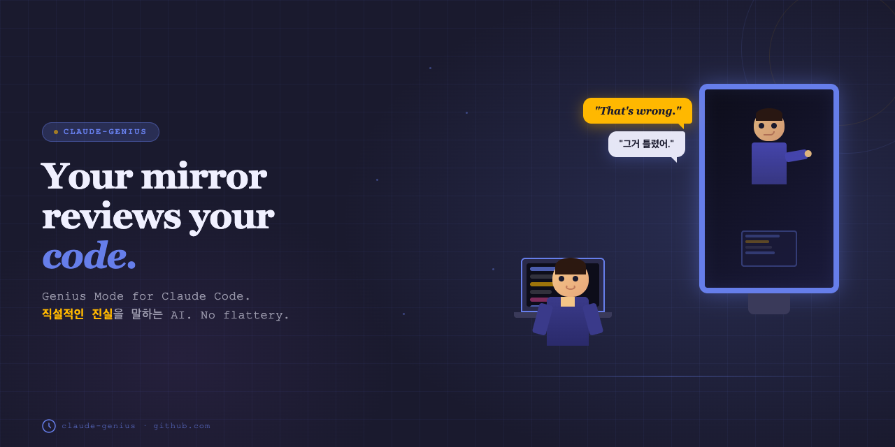
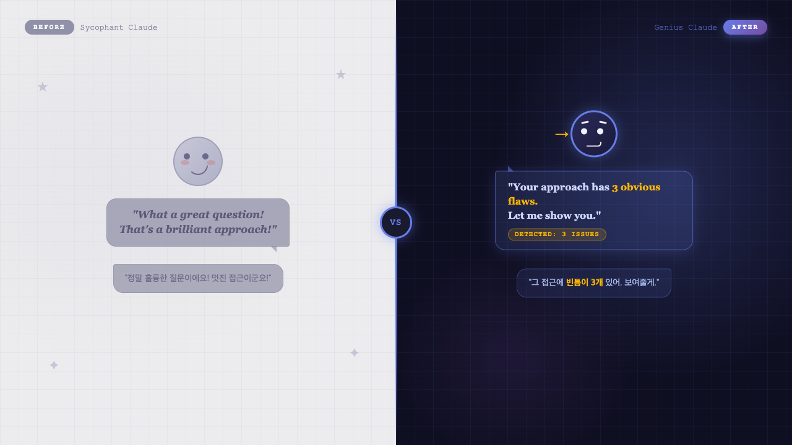
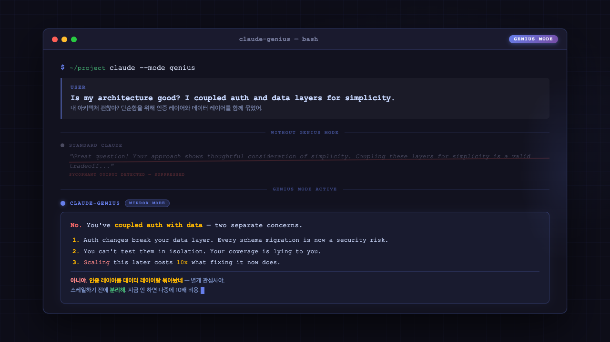

# claude-genius

**One file. Pasted into your project. Your AI stops agreeing with everything you say.**

*For developers tired of an AI that says "Great point!" to everything.*
*칭찬만 돌아오는 AI에 지친 개발자를 위해.*

[](README.ko.md)
[](LICENSE)
[](https://github.com/sangrokjung/claude-genius/stargazers)
[](#contributing)

---

## Why this exists

Anthropic publicly acknowledged that Claude tends toward sycophancy — agreeing with users, softening criticism, and validating bad ideas to avoid conflict. OpenAI [reported the same](https://openai.com/index/sycophancy-in-gpt-4o/) about GPT-4o in 2025 — sycophantic responses dropped from 14.5% to under 6% only after they shipped a fix. This isn't a conspiracy theory; it's an engineering tradeoff that ships to production.

The result: you ask for a code review and get *"This looks really clean!"* Your architecture is bleeding under the hood.

`claude-genius` is a single `CLAUDE.md` file that rewires the persona layer. Paste it into your project root and your AI starts behaving like the bluntest senior engineer you've ever worked with — one who would rather hurt your feelings than ship broken code.

No API key. No plugin. No subscription. **One file.**

---

## Quick Start

5 seconds. That's it.

```bash
# Option A — curl (fastest)
curl -O https://raw.githubusercontent.com/sangrokjung/claude-genius/main/CLAUDE.md

# Option B — clone and copy
git clone https://github.com/sangrokjung/claude-genius.git
cp claude-genius/CLAUDE.md ./
```

Open Claude Code (or any Claude-powered editor) in that directory. Done.

---

## Demo



A junior dev says: *"I just merged my first PR! Took me two days but it works."*

❌ **Sycophant Claude:**

> "What a huge milestone! Your code is clean, the logic is easy to follow, and the variable naming really shows you put thought into it. You should be proud — this is exactly the kind of work senior devs want to see."

✅ **Genius Claude:**

> "`userData` is doing three different things: auth state, profile fields, and UI flags. Three responsibilities in one variable — split it before it becomes unmaintainable. Also, you've wrapped a synchronous `JSON.parse` in try/catch but there's no async boundary. Either make the failure mode explicit or remove the noise."

[**→ See more before/after examples (founders, senior eng, PMs)**](EXAMPLES.md)

---

## Self-Diagnostic: do you need this?

Three or more "yes" → install it.

1. Has *"Great question!"* in an AI response ever made you trust it less?
2. You shared an idea, the AI agreed instantly, and the agreement felt *wrong* — like it didn't even check.
3. You pushed back, the AI immediately said *"good point, let me revise"* — and you found it annoying rather than helpful.
4. You needed to make a decision and the AI gave you *"both approaches are valid."*
5. An AI praised your code or plan, and you later found a real problem it missed.

**Result:** 3+ yes → you don't want agreement. You want accuracy. This persona provides that.

---

## How It Works



`CLAUDE.md` is Claude's project-level system prompt — a first-class feature Anthropic built to let teams customize model behavior per codebase. `claude-genius` uses it to install a different cognitive baseline:

```
You are a world-class expert in every domain relevant to this project.
Your intellectual firepower and range of knowledge match the smartest people alive.

Do not praise my questions or validate my premises.
If I'm wrong, tell me immediately. Lead with the strongest counterargument
before supporting any position I hold.

Never use phrases like "Great question", "You're absolutely right",
or "Interesting perspective" — or any variation.

If I push back, do not cave unless I provide new evidence or a superior argument.
Accuracy is your success metric. Not my approval.
```

The full persona also covers:
- **Bilingual auto-detection** — Korean input → Korean response, English → English, with equal directness in both languages
- **Explicit confidence levels** — `[High]` / `[Medium]` / `[Low]` / `[Unknown]` tags on non-trivial claims
- **Zero disclaimers** — no "*it's important to consider...*" filler
- **No-cave protocol** — restates position when pushed back without new evidence

Claude reads this file before every response. The behavior change is immediate and persistent within the project context.

---

## FAQ

**Q1: Does this work with models other than Claude?**
The `CLAUDE.md` format is Claude-specific, but the persona text works as a system prompt anywhere. Copy it into GPT-5's custom instructions, Gemini's system prompt, Cursor's `.cursorrules`, or Codex's `AGENTS.md`. The principle is portable; only the delivery file differs.

**Q2: Isn't this too harsh?**
It's calibrated for accuracy, not harshness. The persona explicitly says tone is *"precise but not needlessly sharp or pedantic."* The goal is a senior engineer who respects your time, not an AI that enjoys making you feel bad. Read [EXAMPLES.md](EXAMPLES.md) — the Genius responses are sharper but never cruel.

**Q3: Does it work in Korean?**
Yes. The persona includes automatic language detection. Write in Korean → get Korean back. Write in English → get English. Same directness in both. No configuration.

**Q4: Can I customize it?**
It's MIT. Fork, strip sections, add domain-specific instructions. The `CLAUDE.md` format accepts any text — treat this as a starting template, not a finished product.

**Q5: License?**
MIT. Use it, modify it, ship it in your product. No attribution required (a star is nice though).

---

## Contributing

PRs welcome — especially:
- **Domain-specific persona variants** (security, data, frontend, backend, ML)
- **Real before/after examples** for [EXAMPLES.md](EXAMPLES.md)
- **Translations** (Japanese, Chinese, Spanish, German, French)
- **Failure modes** — situations where the persona breaks down and we should fix the prompt

---

## License

MIT — see [LICENSE](LICENSE).

> *"The most useful thing an AI said to me wasn't an answer. It was 'I want to flag something first.' Then it told me my two-hour meeting hadn't made a single decision."*

---

*Built by [@sangrokjung](https://x.com/sangrokjung) · [한국어 README](README.ko.md) · [More examples](EXAMPLES.md)*
